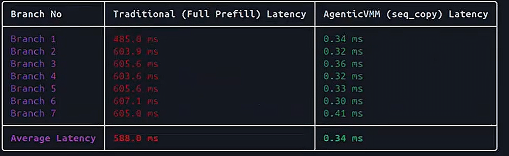
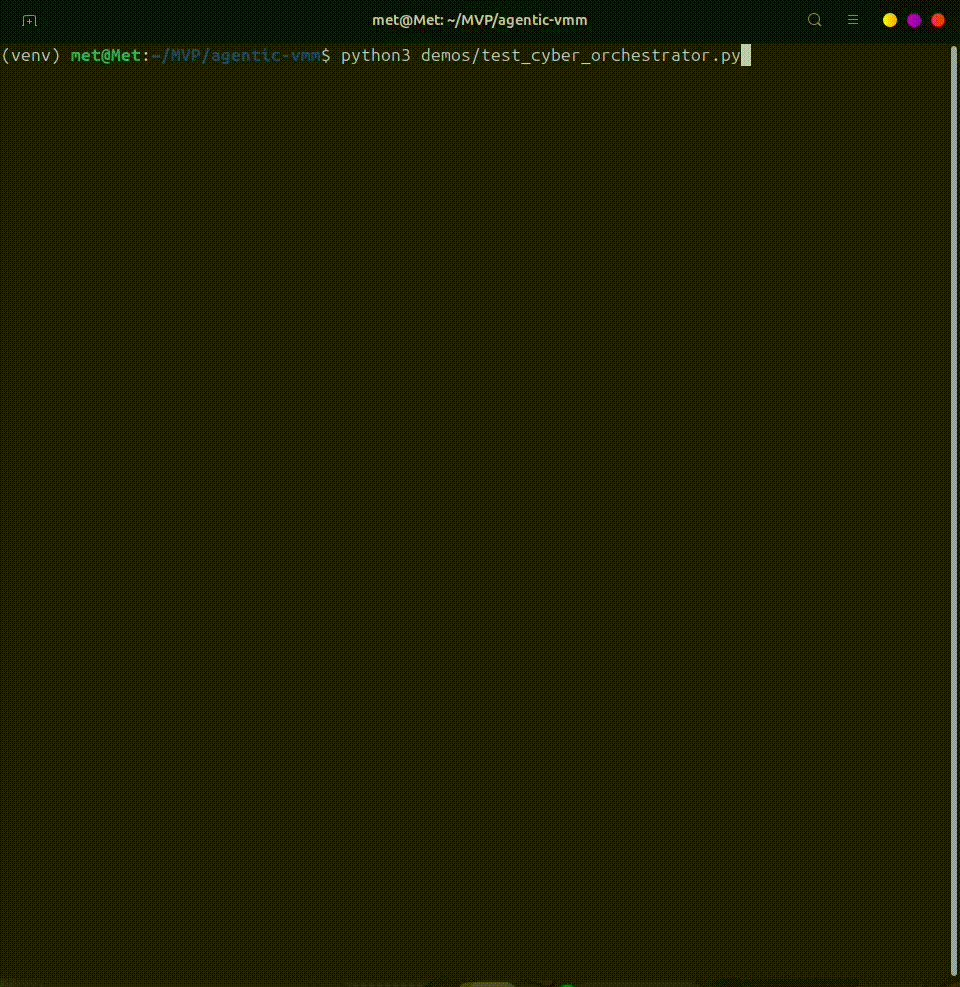

# 🧠 AgenticVMM: O(1) KV-Cache Branching Engine for Edge AI


**Developed for the Microsoft AI Innovators Summer Internship Program**

AgenticVMM is a hardware-accelerated memory management layer for autonomous LLM agents. It completely eliminates the linear $O(n)$ reprefill bottleneck during multi-step reasoning by transforming standard text-based agent memory into a **multidimensional tree structure at the hardware level**.

---

## 🎬 Project Demo & Presentation


[](https://youtu.be/JSr-Zq3bAKY)


---

## 🚀 The Problem: $O(n)$ Reprefill Bottleneck
Traditional autonomous agents face a critical bottleneck when exploring alternative pathways (e.g., testing multiple hypotheses in software debugging or penetration testing). Whenever a path fails, the agent must reprefill the entire context window from scratch. 

As the context grows, this linear $O(n)$ operation freezes the system and rapidly exhausts the VRAM of constrained edge devices.

## 💡 The Solution: Hardware-Level Branching
AgenticVMM bypasses string-level copying entirely. Instead, it utilizes a defensive Python wrapper to interact directly with the `llama.cpp` C-API, physically cloning the KV-Cache pointers in VRAM. 

### Key Features
*   **O(1) KV-Cache Forking:** Branching latency is reduced from seconds to **0.09ms**.
*   **Zero VRAM Delta:** New branches share the root prefix pointer, meaning spawning alternative reasoning paths costs **~0 MiB** of additional VRAM.
*   **True LRU Memory Management:** A custom Least Recently Used (LRU) algorithm automatically evicts failed branches (e.g., `403 Forbidden` routes) while "pinning" successful steps to prevent OOM (Out of Memory) crashes on 6GB/8GB GPUs.
*   **Segfault Protection:** The wrapper verifies memory boundaries before hitting the C layer, ensuring robust uptime.

---

## 📊 Live Benchmark (Edge Device - 6GB VRAM)

Below is the latency curve comparison between the Traditional (String Copy) method and AgenticVMM (Pointer Fork) over 7 continuous branches.




| Metric | Traditional (LangChain) | AgenticVMM | Improvement |
| :--- | :--- | :--- | :--- |
| **Average Branch Latency** | `588.0 ms` | `0.34 ms` | **~1700x Faster** |
| **VRAM Consumption** | Linear $O(n)$ Growth | Zero Delta $O(1)$ | **Infinite Scaling** |

---

## 🛡️ Use Case: Autonomous Penetration Testing
To stress-test the architecture, AgenticVMM was deployed in a simulated cyber-security environment where the agent attempts to breach a target IP (10.10.10.5).

1. **Branch 1 (SSH Brute Force):** `Connection refused`. AgenticVMM rolls back in `0.014ms`.
2. **Branch 2 (SQL Injection):** `WAF blocked (403)`. AgenticVMM rolls back in `0.013ms`.
3. **Branch 3 (Apache CGI-Bin RCE):** `Root access achieved`. AgenticVMM successfully **pins** this state to memory, preventing eviction.





---

## ⚙️ Installation & Usage

### 1. Clone & Setup Environment
```bash
git clone [https://github.com/YOUR_USERNAME/AgenticVMM.git](https://github.com/YOUR_USERNAME/AgenticVMM.git)
cd AgenticVMM
python3 -m venv venv
source venv/bin/activate
pip install -r requirements.txt
```
### 2. Run the BenchmarkTo observe the $O(1)$ branching speed live on your local machine:
```bash 
python3 demos/benchmark_baseline.py
```

